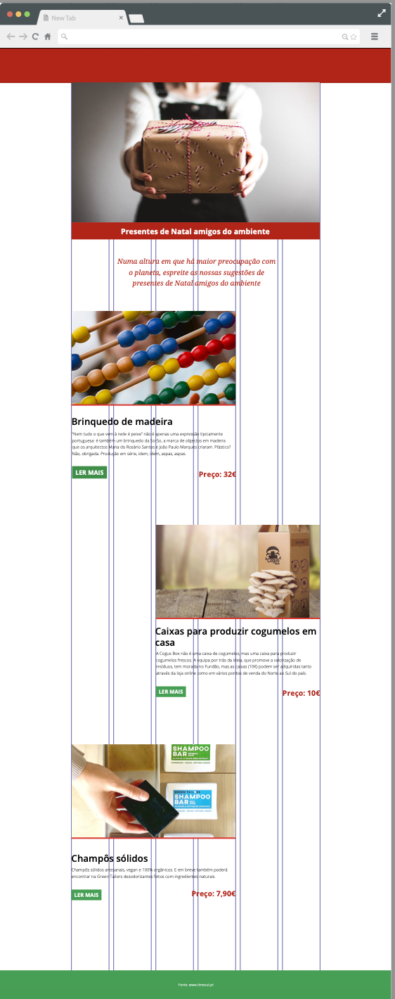

# Aula de introdução ao CSS Grid

Conteúdo pedagógico de introdução à utilização de CSS Grid.

No âmbito da especialização em Web Design do curso de Design de Comunicação da Escola Artística de Soares dos Reis, fazemos uma breve introdução à utilização de CSS Grid.

Estes conteúdos estão estruturados para duas aulas de 90 minutos de duração.

De referir que não se trata de uma abordagem profunda mas apenas uma introdução no âmbito de um curso de design em que se pretende que os alunos conheçam as tecnologias para desenvolverem protótipos dos projetos de design para a web desenvolvidos em Figma.

NOTA: este repositório foi desenvolvido no âmbito de uma formação em Git/GitHub dinamizada pela Associação Nacional de Professores de Informática (outubro 2024).

## AULA 1 - Introdução ao CSS Grid

### Enquadramento (duração estimada: 25min)

Através de um diálogo com os alunos e complementado com uma apresentação a aula inicia-se por:

1. Breve enquadramento dos projetos 1 e 2 deste período: objetivos de cada um.
2. Análise com os alunos acerca das dificuldades sentidas no projeto anterior em termos de codificação em HTML e CSS. 3. Enquadramento acerca da introdução desta técnica no 2o projeto.
4. Porque surge o CSS Grid?
- análise do processo de design e de codificação (com ênfase na proposta anterior) 
- demonstração com o software de desenho de layouts (Figma ou Adobe Illustrator)

### Introdução ao CSS Grid (50min)

Recorrendo uma apresentação, realiza-se uma explicação e demonstração das regras essenciais do CSS Grid. Os alunos acompanham a apresentação e experimentam nos seus computadores, sendo solicitada a intervenção dos alunos na descoberta das soluções a aplicar. 

Ver [apresentação](aula_1/apresentacao/index.html)

No final produzem uma pequena página web contendo algumas situações típicas da sua utilização.

Demonstração: [Ficheiros](aula_1/exercicio_demo_alunos/) base para os alunos 

Demonstração: [Resultado final](aula_1/exercicio_demo_final_prof/)

## AULA 2 - Exercício de aplicação

### Revisão das principais propriedades de CSS Grid (duração estimada: 20min)
1. Em diálogo com os alunos rever os conceitos abordados na última aula;
2. Sistematização das principais propriedades de CSS Grid, através de um jogo interativo online:
https://cssgridgarden.com/

### Exercício de aplicação dos conhecimentos (60min)
#### Apresentação do layout do modelo a desenvolver;

Pretende-se desenvolver um layout equivalente ao seguinte:

[Ficheiros base para o exercício](aula_2/exercicio_aplicacao_alunos/) base para os alunos 

[Resultado final](aula_2/exercicio_aplicacao_versao_final_prof/)

